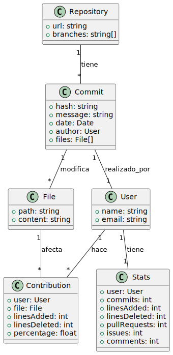
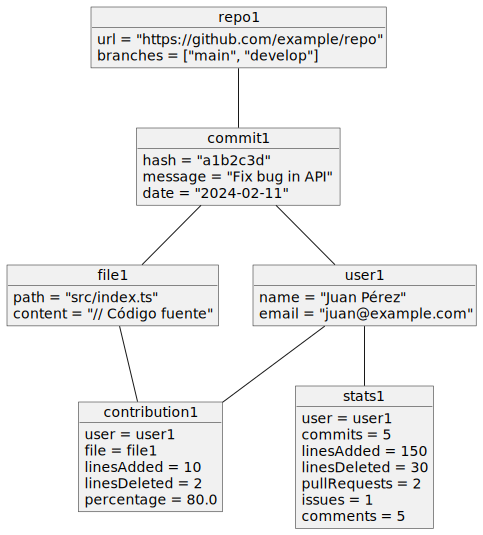
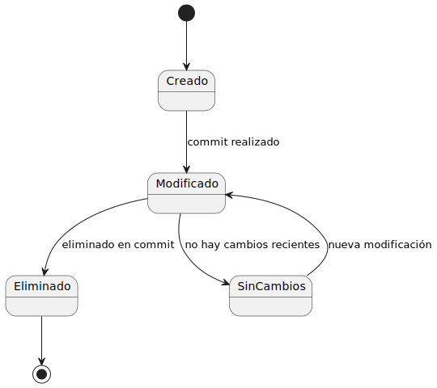
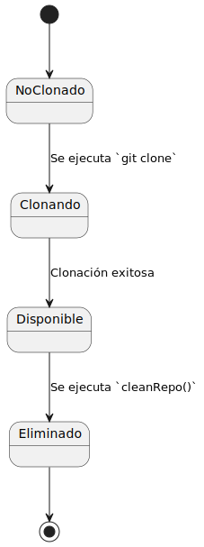
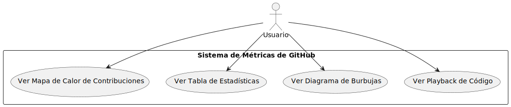
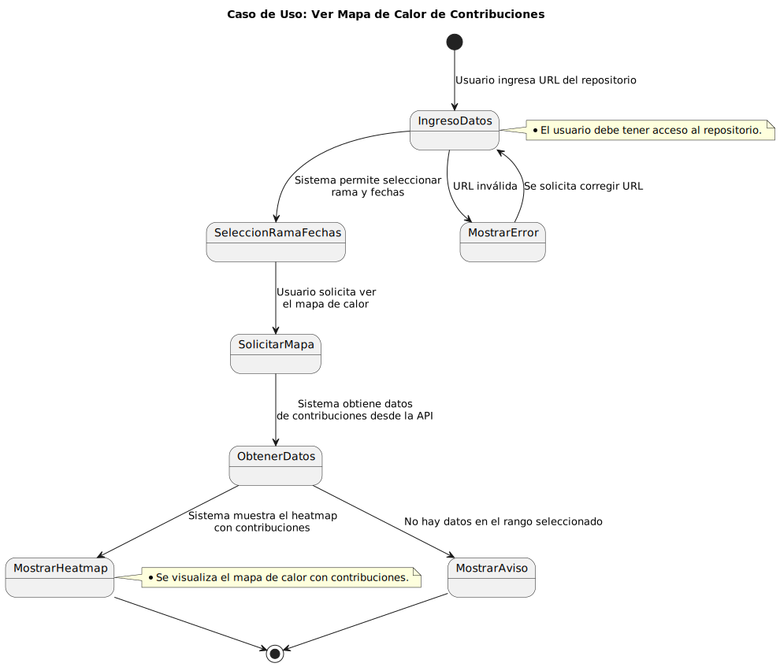
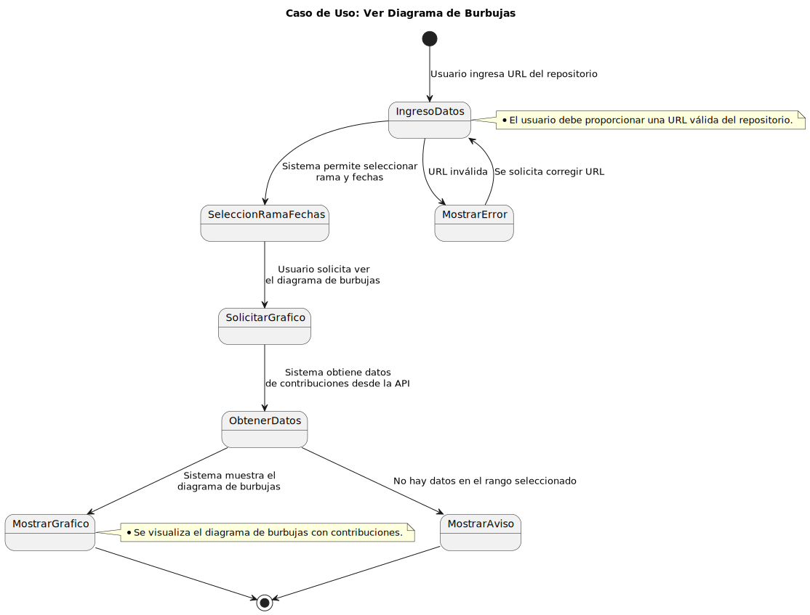
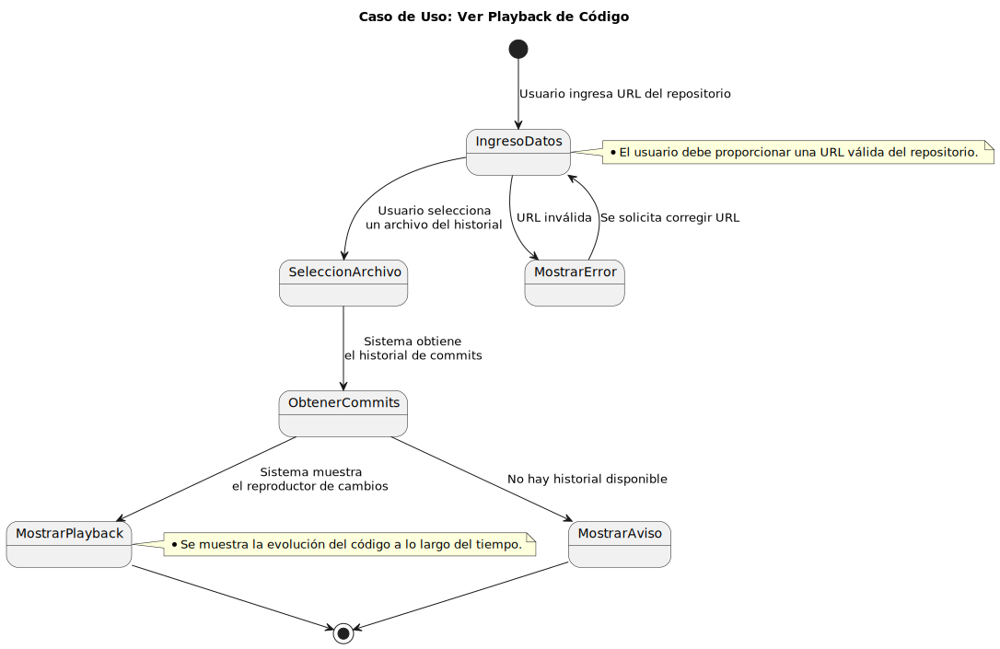
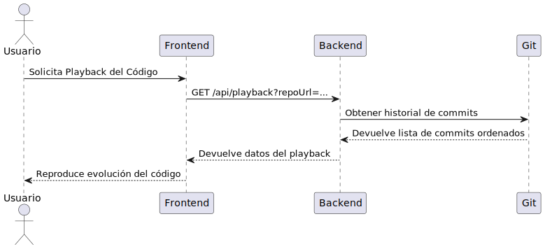
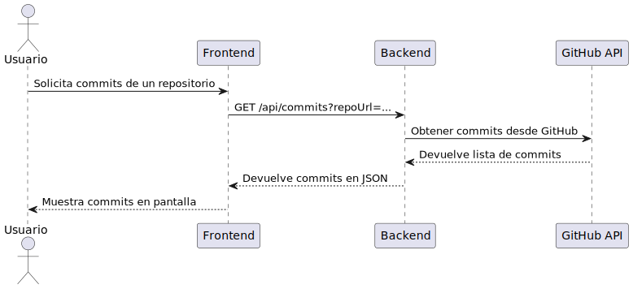

# Documentación del Sistema

## Modelo del Dominio

### Diagrama de Clases

### Diagrama de Objetos

### Diagrama de Estados archivo

### Diagrama de Estados repositorio

## Disciplina de Requisitos

### Actores del Sistema
- **Usuario**: Interactúa con el sistema para visualizar datos y realizar acciones.
- **Sistema**: Procesa los datos y genera las visualizaciones.

### Casos de Uso

### Detalle de casos de Uso:

#### Ver Mapa de Calor de Contribuciones

#### Ver Tabla de Estadísticas

#### Ver Diagrama de Burbujas

#### Ver Playback de Código

## Diagramas de Secuencia

### Secuencia - Playback de Código

### Secuencia - Commit

