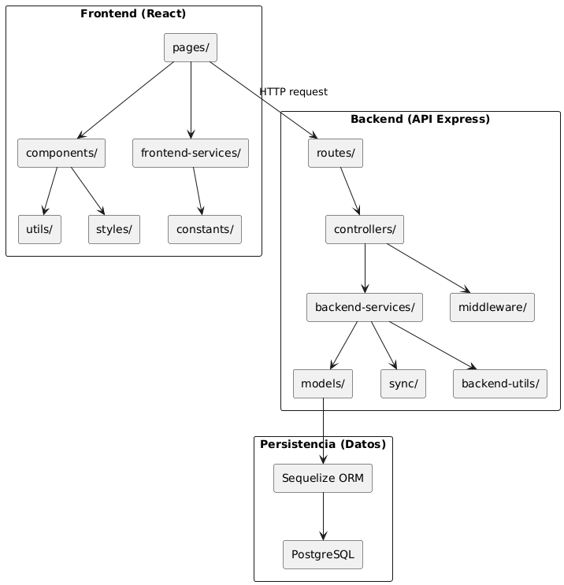

# Sistema de auditoría de repositorios de GitHub

## Marco teórico: 

### Uso de repositorios en Ingeniería Informática
- El uso de GitHub se ha convertido en un estándar dentro del desarrollo de software (facilitando el control de versiones, la colaboración en equipo y la trazabilidad del código). 
- En el ámbito académico, especialmente en Ingeniería Informática, su adopción ha permitido a los estudiantes familiarizarse con flujos de trabajo reales desde etapas tempranas de su formación. 
- A pesar de ello, la evaluación del desempeño individual dentro de los proyectos grupales sigue siendo un reto, ya que las métricas tradicionales como número de commits o líneas de código pueden ser fácilmente manipuladas y no reflejan con precisión la calidad ni el impacto de las contribuciones.

### Uso de repositorios en la Universidad Europea del Atlántico
- Programación I y II.
- Introducción a la Gestión de Proyectos Software.
- Bases de datos I y II.
- Estructuras de Datos y Algoritmos I y II.
- Ingeniería de Software I y II.
- Sistemas Distribuidos y Programación en Paralelo.
- Dirección de Sistemas de la Información.
- Programación web I y II.

## Modelo del dominio:

## Diagrama de estados:

## Actores y Casos de Uso

### Actor único: 
El sistema está diseñado para ser utilizado por un único actor: el **cliente**, típicamente un **docente universitario** que desea auditar la participación de sus estudiantes en proyectos colaborativos alojados en GitHub. Este cliente busca:

### Casos de uso:

.png)
.png)
.png)

## Diagrama de contexto

### Navegación

### Funcionalidad 1 y 2: Visualizador estructura del repositorio

### Funcionalidad 3: Mapa de calor

### Funcionalidad 4: Mapa de burbujas

### Funcionalidad 5: Análisis multidimensional

### Funcionalidad 6: Gráfico de ramas y commits

## Detalle de casos de uso:

### CU06: Seleccionar un archivo para el playback:

#### Interfaz de usuario propuesta:

#### Análisis (MVC):

##### Capa de presentación:

##### Capa de negocio:

##### Capa de datos:

##### Diseño caso de uso 06: Playback:

#### Diseño:

##### Tecnologías empleadas

| Categoría         | Tecnología         | Descripción breve                                      |
|-------------------|--------------------|--------------------------------------------------------|
| Backend           | Node.js            | Entorno de ejecución JavaScript del lado del servidor |
| Backend           | Express.js         | Framework minimalista para construir APIs REST        |
| Backend           | Sequelize          | ORM para gestionar modelos y consultas en PostgreSQL  |
| Base de datos     | PostgreSQL         | Sistema de gestión de bases de datos relacional       |
| Frontend          | React.js           | Librería para construir interfaces de usuario         |
| Frontend          | Tailwind CSS       | Framework de CSS utilitario                           |
| Frontend          | ShadCN/UI          | Librería de componentes UI moderna basada en Tailwind |
| API externa       | GitHub REST API    | Fuente de datos para auditar repositorios             |
| Contenedores      | Docker             | Contenedores para backend, frontend y base de datos   |
| Orquestación      | docker-compose     | Orquestación de servicios Docker                      |
| Despliegue        | DigitalOcean       | Plataforma de despliegue en la nube                   |
| Dominio propio    | auditoria.me       | Dominio personalizado configurado con Namecheap       |
| Servidor web      | Nginx              | Servidor proxy inverso para gestión de HTTPS          |

##### Diagrama de colaboración entre capas:

##### Diagrama de colaboración CU06:

##### Diagrama de secuencia CU06:

### CU08, CU15, CU19: [Ver](./Documentación//Detalle%20de%20casos%20de%20uso//readme.md)

## Solución: 
https://auditoria.me

## Repositorios de prueba:
- https://github.com/VeronikaEspa/23-24-IdSw1-SDR.git
- https://github.com/0xJVR/24-25-IdSw2-SDD.git
- https://github.com/aadrigaar/24-25-IdSw2-SDD.git
- https://github.com/TheMoys/24-25-IdSw1-SDR.git
- https://github.com/oscarsantasanchez/24-25-IdSw2-SDD.git

## Conclusiones

- El sistema desarrollado permite auditar de forma efectiva la participación de los estudiantes en proyectos colaborativos.
- Ofrece métricas más ricas y representativas que las utilizadas tradicionalmente.
- El diseño modular y extensible del sistema abre la puerta a futuras mejoras, como nuevas visualizaciones o integración con plataformas académicas existentes como Moodle o GitHub Classroom.
- Ha sido probado con repositorios reales de asignaturas del grado en Ingeniería Informática, validando su utilidad y usabilidad en un contexto docente real.

